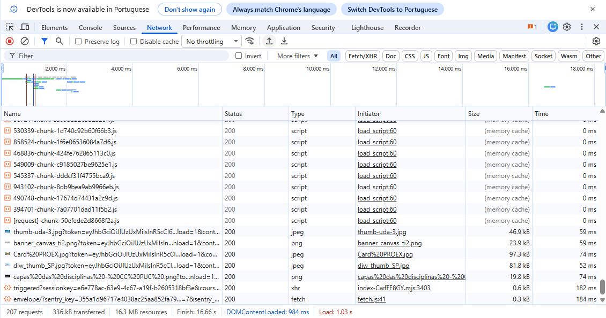
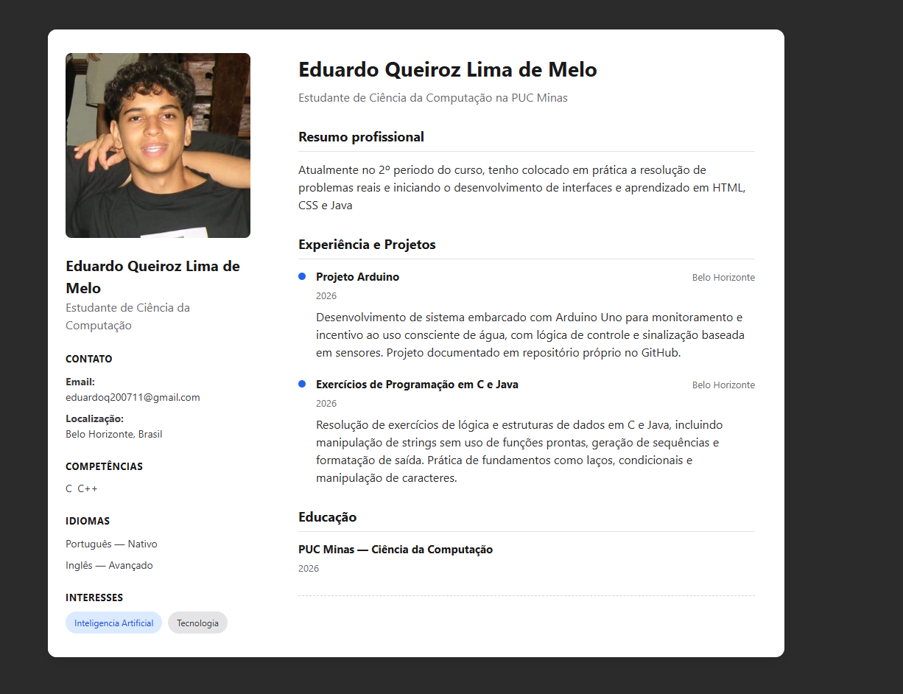

# Repositório de Exercícios - DIW PUC Minas

**Aluno:** Eduardo Queiroz  
**Matrícula:** 911002  

---

## Semana 2 - Atividade pratica

### 1. Inspeção de Rede do Portal

### 2. Visualização do index.html

---

## Semana 3 - Atividade pratica

### Visualização do Currículo

